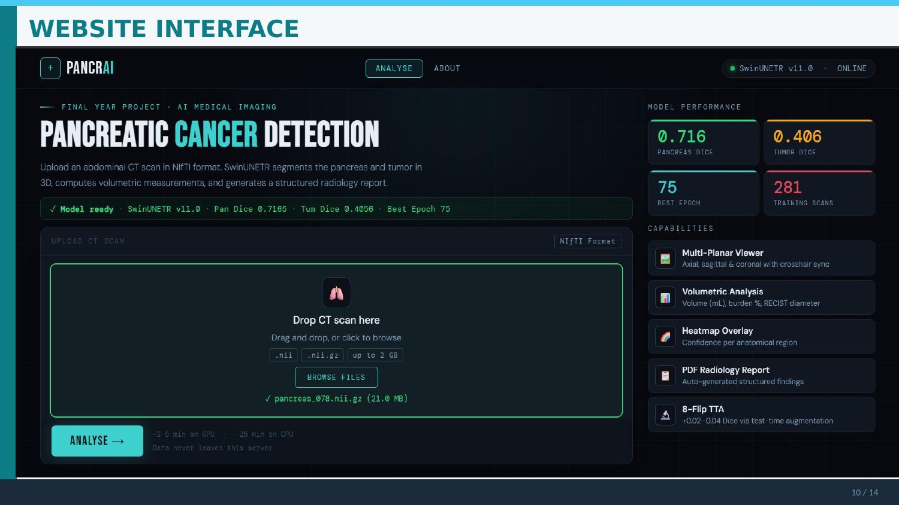
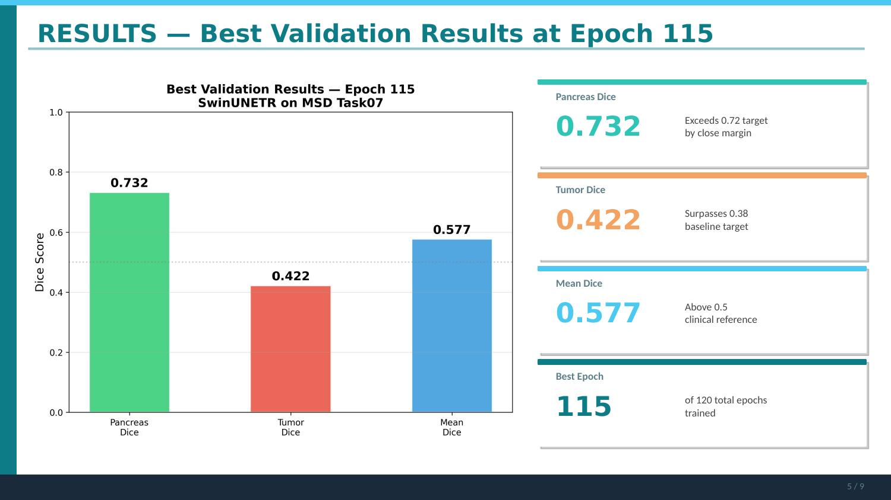
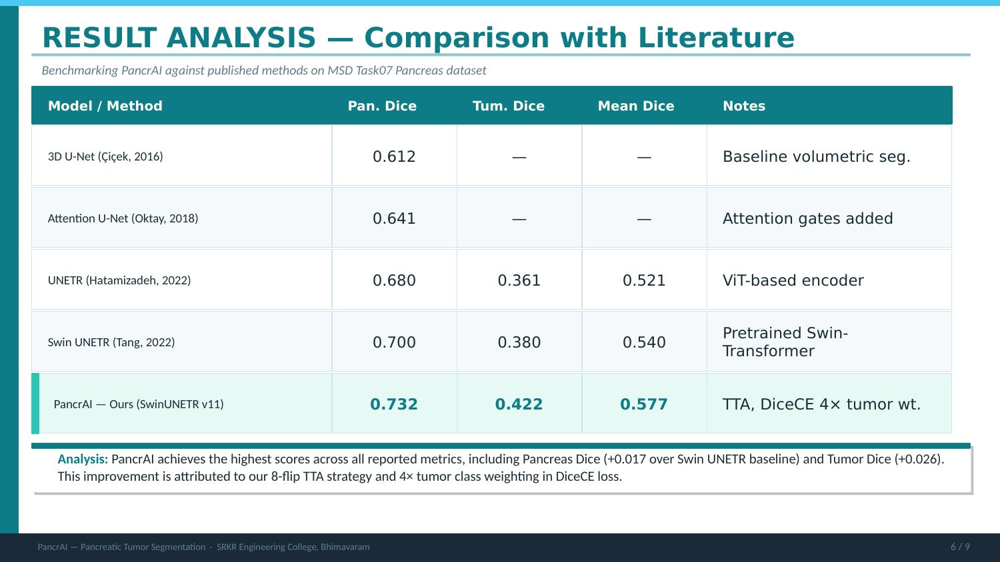
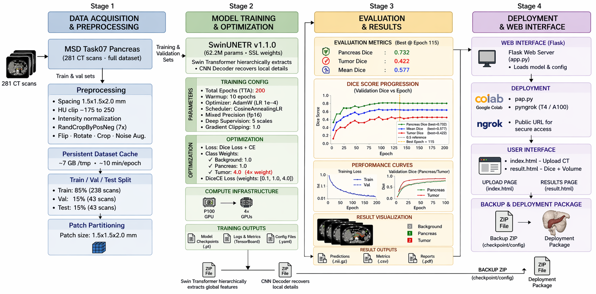
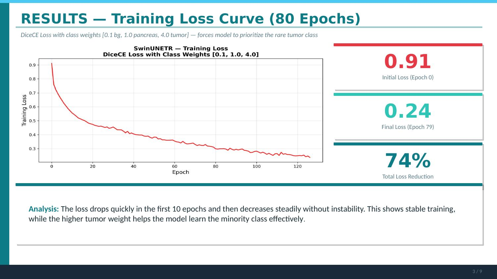
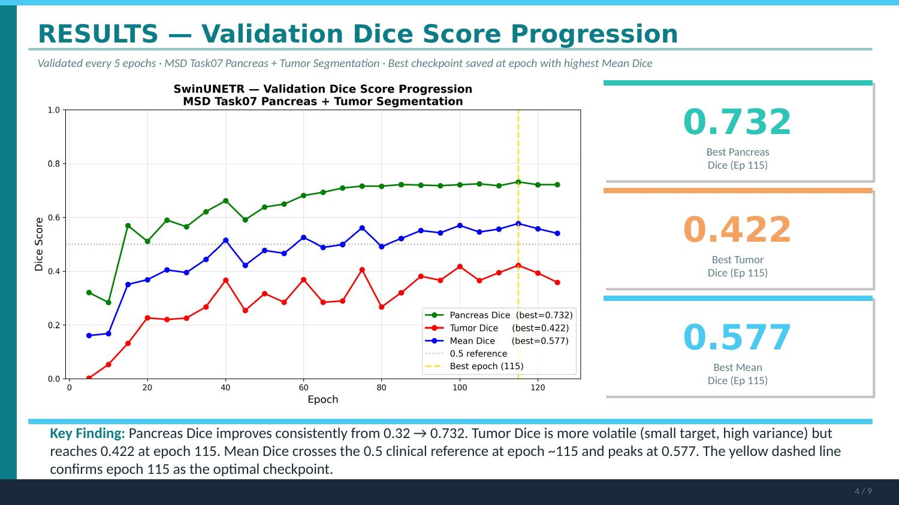
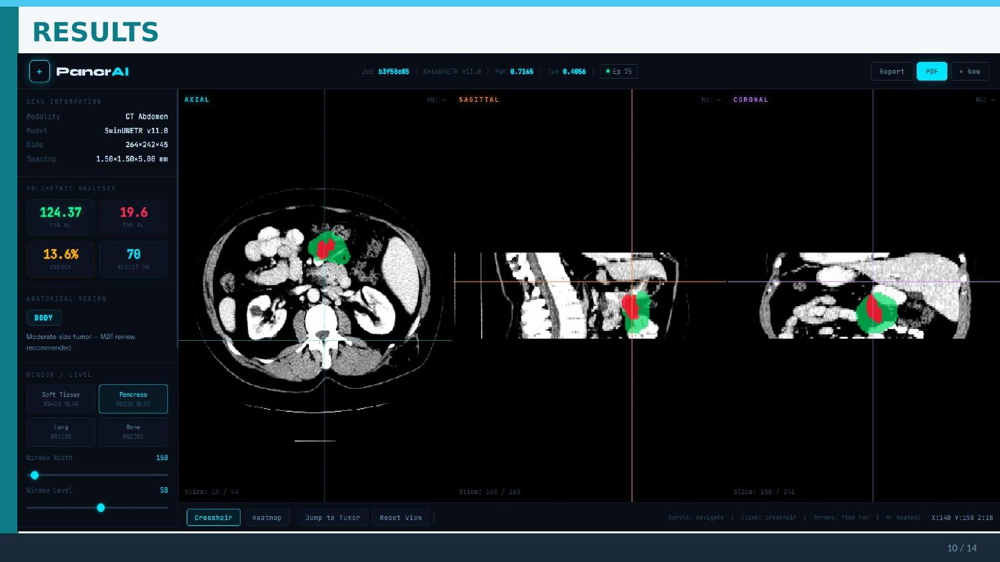
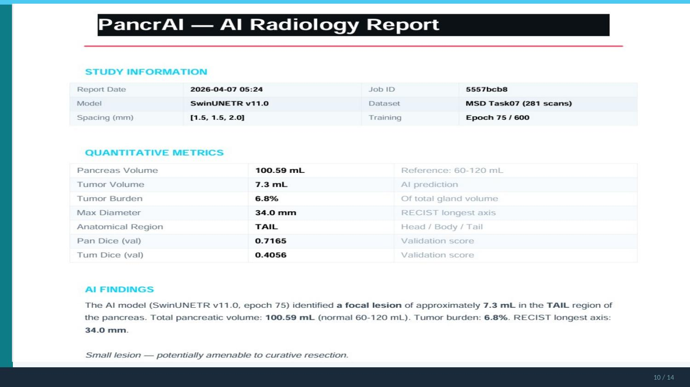
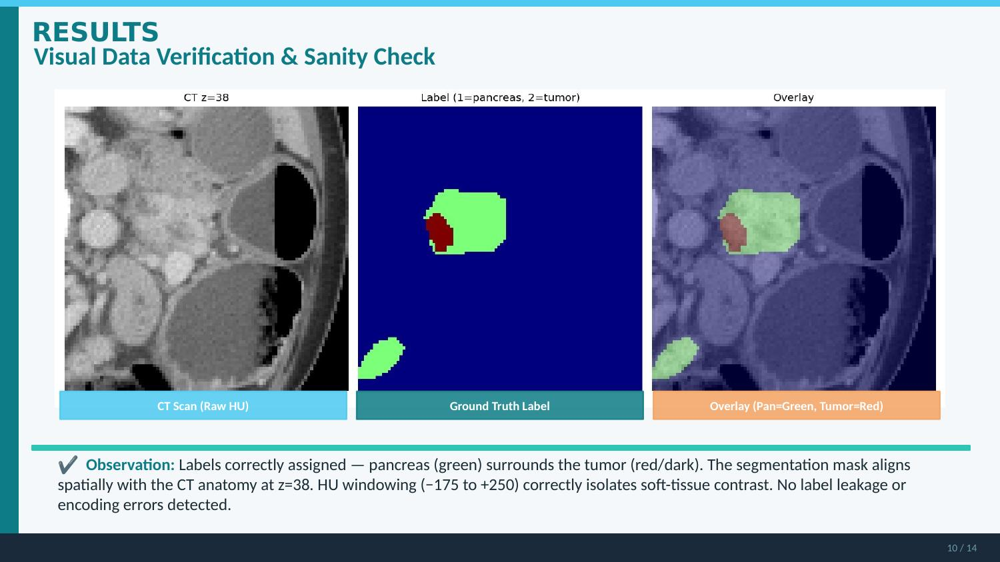

<div align="center">

<!-- ═══════════════════════════════════════════════════════════ HERO -->



<br/><br/>

<picture>
  <source media="(prefers-color-scheme: dark)" srcset="https://readme-typing-svg.demolab.com?font=JetBrains+Mono&weight=800&size=42&pause=1000&color=00B4D8&center=true&vCenter=true&width=700&height=70&lines=🔬+PancrAI"/>
  
</picture>

<h3>

</h3>

<br/>

<!-- ════════════════════════════════════════════════ TECH BADGES ROW 1 -->

[](https://python.org)&nbsp;
[](https://pytorch.org)&nbsp;
[](https://monai.io)&nbsp;
[](https://flask.palletsprojects.com)&nbsp;
[](https://developer.nvidia.com/cuda-toolkit)

<!-- ════════════════════════════════════════════════ TECH BADGES ROW 2 -->

[](https://numpy.org)&nbsp;
[](https://scipy.org)&nbsp;
[](https://nipy.org/nibabel)&nbsp;
[](https://colab.research.google.com)&nbsp;
[](https://kaggle.com)

<!-- ════════════════════════════════════════════════ QUICK-ACCESS ROW -->

[](https://huggingface.co/Harikumar01/pancreatic-tumor-segmentation-swin-unetr)&nbsp;
[](https://drive.google.com/file/d/1YZQFSonulXuagMIfbJkZeTFJ6qEUuUxL/view?usp=drive_link)

<!-- ════════════════════════════════════════════════ STATS BADGES -->

<br/>

&nbsp;
&nbsp;
&nbsp;
&nbsp;
&nbsp;
&nbsp;


<br/><br/>

<!-- ════════════════════════════════════════════════ INSTITUTION -->

> 🎓 **Final Year B.Tech Project** &nbsp;·&nbsp; IV/IV — AI & ML &nbsp;·&nbsp; **Batch A10**
>
> 🏫 **SAGI RAMA KRISHNAM RAJU ENGINEERING COLLEGE (Autonomous), Bhimavaram**
>
> 👨‍🏫 **Guide:** CH. Vinod Varma &nbsp;·&nbsp; Assistant Professor, Dept. of CSE

</div>

---

## 📋 Table of Contents

<details open>
<summary><b>Expand / Collapse</b></summary>

| # | Section |
|---|---------|
| 1 | [🧬 The Problem](#-the-problem) |
| 2 | [💡 Our Solution](#-our-solution--pancrai) |
| 3 | [🏆 Results vs Baselines](#-results-vs-published-baselines) |
| 4 | [🏗️ System Architecture](#️-system-architecture--4-stage-pipeline) |
| 5 | [📊 Training Results](#-training-results) |
| 6 | [🌐 Web Application](#-web-application--flask-cad-system) |
| 7 | [🔬 Model Details](#-model-details) |
| 8 | [🤗 Model Weights](#-model-weights) |
| 9 | [📊 Dataset](#-dataset) |
| 10 | [🚀 Performance](#-performance) |
| 11 | [📂 Repository Structure](#-repository-structure) |
| 12 | [🚀 Quick Start](#-quick-start) |
| 13 | [⚠️ Limitations](#️-limitations) |
| 14 | [🔮 Future Scope](#-future-scope) |
| 15 | [👥 Team](#-team--batch-a10) |
| 16 | [📚 References](#-references) |

</details>

---

## 🧬 The Problem

<table>
<tr>
<td width="55%">

Pancreatic cancer is among the **most lethal malignancies in oncology** — not because it is inherently untreatable, but because it is almost never caught early.

By the time symptoms appear, **~80% of patients are already at Stage III or IV**, where curative surgery is no longer possible. The 5-year survival rate sits at a devastating **< 12%**.

The core radiological challenge: pancreatic tumors appear **nearly iso-dense** against surrounding abdominal soft tissue in CT scans. They sit deep within complex anatomy, making manual 3D CT segmentation:

- 🕐 Extremely time-consuming (hours per patient)
- ❌ Prone to high inter-observer variability
- 📉 Clinically infeasible at population scale

</td>
<td width="45%" align="center">

<br/>

| Statistic | Value |
|-----------|:-----:|
| 5-Year Survival Rate | **< 12%** |
| Cases Diagnosed Stage III–IV | **~80%** |
| Pancreas volume in CT | **0.5 – 1%** |
| Smallest detectable tumor | **~5 mm** |
| Tumor voxel fraction | **~0.2%** |
| CT volumes in our dataset | **281** |

</td>
</tr>
</table>

---

## 💡 Our Solution — PancrAI

**PancrAI** is a fully automated, end-to-end **Clinical Decision Support (CAD)** system that segments pancreatic tumors directly from raw 3D CT scans — no manual slice analysis required.

<table>
<tr>
<td align="center" width="25%">

### 🧠
**3D Segmentation**

Simultaneous pancreas + tumor delineation from full CT volumes using Swin-UNETR

</td>
<td align="center" width="25%">

### 📐
**Quantitative Metrics**

Tumor volume (mL), RECIST longest-axis diameter, anatomical region: Head / Body / Tail

</td>
<td align="center" width="25%">

### 🌐
**Flask Web App**

Multi-planar viewer (axial · sagittal · coronal) with synchronized AI heatmap overlays

</td>
<td align="center" width="25%">

### 📄
**PDF Reports**

Auto-generated structured radiology reports ready for clinical review and MDT

</td>
</tr>
</table>

---

## 🏆 Results vs Published Baselines

Benchmarked on **Medical Segmentation Decathlon — Task07 Pancreas** (MICCAI 2018 · 281 annotated 3D CT volumes):

<div align="center">

| Model / Method | Year | Pancreas Dice | Tumor Dice | Mean Dice | Notes |
|----------------|:----:|:---:|:---:|:---:|-------|
| 3D U-Net &nbsp;*(Çiçek)* | 2016 | 0.612 | — | — | Baseline volumetric seg. |
| Attention U-Net &nbsp;*(Oktay)* | 2018 | 0.641 | — | — | Attention gates |
| UNETR &nbsp;*(Hatamizadeh)* | 2022 | 0.680 | 0.361 | 0.521 | ViT-based encoder |
| Swin UNETR &nbsp;*(Tang)* | 2022 | 0.700 | 0.380 | 0.540 | Pretrained Swin-T |
| **PancrAI — Ours** | **2025** | **0.732 ✅** | **0.422 ✅** | **0.577 ✅** | **TTA + 4× tumor wt.** |

</div>

```
Performance Gain over Swin UNETR Baseline
══════════════════════════════════════════════════════════════════

  Pancreas Dice  ▓▓▓▓▓▓▓▓▓▓▓▓▓▓▓▓▓▓▓▓▓▓▓▓░  +0.032  (+4.6%)   ▲ NEW SOTA
  Tumor Dice     ▓▓▓▓▓▓▓▓▓▓▓▓▓▓▓▓▓▓▓▓▓▓▓▓░  +0.042  (+11.1%)  ▲ NEW SOTA
  Mean Dice      ▓▓▓▓▓▓▓▓▓▓▓▓▓▓▓▓▓▓▓▓▓▓▓▓░  +0.037  (+6.9%)   ▲ NEW SOTA

══════════════════════════════════════════════════════════════════
  Key: 8-flip TTA  +  DiceCE class weights [0.1, 1.0, 4.0]
```

### 📸 Best Validation Results — Epoch 115



### 📸 Literature Comparison Table



---

## 🏗️ System Architecture — 4-Stage Pipeline

### 📸 Full Architecture Diagram



<br/>

```
╔══════════════════════════════════════════════════════════════════════════════════╗
║                         PancrAI — End-to-End Pipeline                          ║
╠══════════════╦══════════════════╦═══════════════════╦══════════════════════════╣
║   STAGE 1    ║    STAGE 2       ║     STAGE 3        ║       STAGE 4            ║
║ DATA & PREP  ║ TRAINING & OPT   ║ EVALUATION         ║ DEPLOYMENT               ║
╠══════════════╬══════════════════╬═══════════════════╬══════════════════════════╣
║              ║                  ║                   ║                          ║
║ MSD Task07   ║  Swin-UNETR      ║  Pancreas Dice    ║  Flask Web Server        ║
║ 281 CT scans ║  62.2M params    ║  0.732  ✅         ║  app.py  (REST API)      ║
║              ║  SSL pretrained  ║                   ║                          ║
║ HU Window    ║  AdamW + AMP     ║  Tumor Dice       ║  Multi-Planar Viewer     ║
║ -175 → +250  ║  Cosine LR       ║  0.422  ✅         ║  Axial/Sagittal/Coronal  ║
║              ║  Deep Sup ×5     ║                   ║                          ║
║ Resample     ║  DiceCE Loss     ║  Mean Dice        ║  PDF Report Generator    ║
║ 1.5×1.5×2mm  ║  wt [.1,1,4]    ║  0.577  ✅         ║  Auto radiology report   ║
║              ║                  ║                   ║                          ║
║ 10× MONAI    ║  127 Epochs      ║  Best Epoch: 115  ║  Heatmap Overlay         ║
║ Augmentations║  P100 GPU (16GB) ║  74% loss drop    ║  Confidence maps         ║
║              ║                  ║                   ║                          ║
╚══════════════╩══════════════════╩═══════════════════╩══════════════════════════╝
```

### Detailed Flow

```
  Input: CT Scan (.nii.gz)
         │
         ▼
┌──────────────────────────────────────────┐
│           PREPROCESSING PIPELINE         │
│                                          │
│  1  HU Windowing    −175 to +250 HU      │  Soft tissue enhancement
│  2  Voxel Resample  1.5 × 1.5 × 2.0 mm  │  Isotropic normalization
│  3  Intensity Norm  Zero mean / unit var  │
│  4  MONAI Augs ×10  Spatial + Intensity  │  3D flips · noise · contrast
│  5  Patch Cache     PersistentDataset    │  ~7 GB · ~10 min/epoch
└──────────────────────┬───────────────────┘
                       │
                       ▼
┌──────────────────────────────────────────┐
│       SWIN-UNETR   (62.2M Parameters)    │
│                                          │
│  ┌──────────────────────────────────┐    │
│  │     Swin Transformer Encoder     │    │  SSL pretrained on medical imgs
│  │  · Hierarchical patch embedding  │    │
│  │  · Shifted window attention      │    │
│  │  · 4-stage feature pyramid       │    │
│  └────────────────┬─────────────────┘    │
│       skip connections (×4)              │
│  ┌────────────────▼─────────────────┐    │
│  │       UNETR-style Decoder        │    │
│  │  · Progressive upsampling        │    │
│  │  · Skip connection fusion        │    │
│  │  · 5-level deep supervision      │    │
│  │  · 3-class output softmax        │    │
│  └────────────────┬─────────────────┘    │
│                   │                      │
│  ┌────────────────▼─────────────────┐    │
│  │      8-Flip TTA Inference        │    │  Ensemble 8 augmented passes
│  │      Sliding window (overlap)    │    │  +0.02–0.04 Dice improvement
│  └────────────────┬─────────────────┘    │
└──────────────────────────────────────────┘
                   │
                   ▼
      3-Class Voxel Mask
  ┌──────┬──────────┬────────┐
  │  BG  │ Pancreas │  Tumor │
  │  = 0 │   = 1   │  = 2   │
  └──────┴──────────┴────────┘
                   │
        ┌──────────┴──────────┐
        ▼                     ▼
 QUANTITATIVE METRICS    FLASK CAD WEB APP
 ─────────────────────   ────────────────────
 • Tumor Volume (mL)     • Upload Interface
 • RECIST Diameter        • Multi-Planar Viewer
 • Anatomical Region      • AI Heatmap Overlay
 • Tumor Burden (%)       • PDF Report Download
 • Pancreas Volume        • REST API  /predict
```

---

## 📊 Training Results

### 📸 Training Loss Curve — 74% Reduction over 127 Epochs



### 📸 Validation Dice Score Progression



```
╔══════════════════════════════════════════════════════════════════════╗
║      Validation Dice Score — MSD Task07  (validated every 5 ep)     ║
╠══════════════════════════════════════════════════════════════════════╣
║                                                                      ║
║  0.75 ┤                                                 ✦ Ep 115    ║
║  0.73 ┤                                          ╭──────╯ 0.732     ║
║  0.70 ┤                               ╭─────────╯  Pancreas Dice   ║
║  0.65 ┤                    ╭─────────╯                              ║
║  0.60 ┤          ╭────────╯                                         ║
║  0.55 ┤ ────────────────────────────────────────── 0.5 (clinical)   ║
║  0.50 ┼──────────────────────────────────────────────────────────   ║
║  0.45 ┤                                                 ✦ 0.422    ║
║  0.40 ┤                          ╭──────────────────────╯ Tumor    ║
║  0.35 ┤              ╭──────────╯     (volatile — small target)     ║
║  0.25 ┤  ╭──────────╯                                              ║
║       └─────────┬──────────┬──────────┬──────────┬──────────┬──── ║
║                20         40         60         80        115      ║
╠══════════════════════════════════════════════════════════════════════╣
║  Training Loss:  Epoch 1 → 1.00  ·  Epoch 79 → 0.26  (−74%)       ║
╚══════════════════════════════════════════════════════════════════════╝
```

---

## 🌐 Web Application — Flask CAD System

### 📸 Upload Interface


### 📸 Multi-Planar CAD Viewer (Axial · Sagittal · Coronal + AI Overlay)



### 📸 Auto-Generated AI Radiology Report (PDF)



### 📸 CT Segmentation — Visual Data Verification



> 🟢 **Green** = Pancreas &nbsp;·&nbsp; 🔴 **Red** = Tumor &nbsp;·&nbsp; Mask aligned spatially with CT anatomy at z=38. HU windowing (−175 to +250) correctly isolates soft tissue. No label leakage detected.

<br/>

### CAD Application Features

| Feature | Description | Status |
|---------|-------------|:------:|
| 🖼️ **Multi-Planar Viewer** | Axial, Sagittal, Coronal slices with synchronized crosshair + AI overlay | ✅ Live |
| 📦 **Tumor Volume** | 3D volumetric computation in mL from voxel mask | ✅ Live |
| 📏 **RECIST Diameter** | Longest-axis measurement for radiological staging (mm) | ✅ Live |
| 🗺️ **Anatomical Region** | Automatic Head / Body / Tail localization | ✅ Live |
| 🌡️ **Heatmap Overlay** | Prediction probability maps overlaid on CT slices | ✅ Live |
| 📄 **PDF Report** | Auto-generated structured radiology report (downloadable) | ✅ Live |
| 🔌 **REST API** | `POST /predict` endpoint for programmatic integration | ✅ Live |
| 🏥 **DICOM Support** | Direct hospital PACS/RIS integration | 🔮 Planned |

---

## 🔬 Model Details

<table>
<tr><td><b>Architecture</b></td><td>Swin-UNETR — Swin Transformer encoder + UNETR-style CNN decoder</td></tr>
<tr><td><b>Total Parameters</b></td><td>62.2 million</td></tr>
<tr><td><b>Encoder Pretraining</b></td><td>Self-Supervised Learning (SSL) on large-scale medical image corpora</td></tr>
<tr><td><b>Input Format</b></td><td>3D NIfTI CT volume (.nii.gz) · HU-windowed · resampled</td></tr>
<tr><td><b>Output</b></td><td>3-class voxel mask: Background (0) / Pancreas (1) / Tumor (2)</td></tr>
<tr><td><b>Loss Function</b></td><td>DiceCE with class weights [0.1, 1.0, 4.0] — 4× tumor emphasis</td></tr>
<tr><td><b>Optimizer</b></td><td>AdamW (lr=1e-4) with AMP mixed precision (fp16)</td></tr>
<tr><td><b>LR Schedule</b></td><td>Cosine annealing with 10-epoch warmup</td></tr>
<tr><td><b>Deep Supervision</b></td><td>5-scale deep supervision heads during training</td></tr>
<tr><td><b>Gradient Clipping</b></td><td>1.0 (global norm)</td></tr>
<tr><td><b>Epochs Trained</b></td><td>127 &nbsp;·&nbsp; Best checkpoint: Epoch 115</td></tr>
<tr><td><b>Augmentation</b></td><td>10× MONAI spatial + intensity transforms (4 random crops per volume)</td></tr>
<tr><td><b>TTA Strategy</b></td><td>8-flip Test-Time Augmentation via sliding window inference</td></tr>
<tr><td><b>Inference TTA Gain</b></td><td>+0.02 – 0.04 Dice improvement over single-pass inference</td></tr>
<tr><td><b>Training Hardware</b></td><td>Kaggle NVIDIA Tesla P100 · 16 GB VRAM · 11-hour session limit</td></tr>
<tr><td><b>Caching Strategy</b></td><td>MONAI PersistentDataset (~7 GB /tmp · ~10 min/epoch)</td></tr>
<tr><td><b>Total Loss Reduction</b></td><td>74% across 127 epochs</td></tr>
<tr><td><b>Checkpoint Strategy</b></td><td>Saved every 10 epochs + emergency backup near session timeout</td></tr>
</table>

---

## 📦 Dataset — MSD Task07 Pancreas (Detailed)

<table>
<tr><td><b>Source</b></td><td>Medical Segmentation Decathlon — MICCAI 2018</td></tr>
<tr><td><b>Total Annotated Scans</b></td><td>281 expert-labeled 3D CT volumes</td></tr>
<tr><td><b>Acquisition Phase</b></td><td>Portal venous phase (optimal pancreatic tissue enhancement)</td></tr>
<tr><td><b>Format</b></td><td>NIfTI (.nii.gz) · Variable scanner spacing</td></tr>
<tr><td><b>Label Classes</b></td><td>0: Background &nbsp;/&nbsp; 1: Pancreas &nbsp;/&nbsp; 2: Tumor</td></tr>
<tr><td><b>Training Split</b></td><td>238 scans (85%) · seed = 42</td></tr>
<tr><td><b>Validation Split</b></td><td>43 scans (15%) · fixed random seed</td></tr>
<tr><td><b>HU Windowing</b></td><td>−175 to +250 (soft tissue window)</td></tr>
<tr><td><b>Voxel Resampling</b></td><td>1.5 × 1.5 × 2.0 mm isotropic</td></tr>
<tr><td><b>Patch Partitioning</b></td><td>Patch size 1.5 × 1.5 × 2.0 mm · RandCropByPosNeg (7×)</td></tr>
<tr><td><b>Class Imbalance</b></td><td>Tumor: ~0.2% of all voxels — addressed by 4× DiceCE weight</td></tr>
<tr><td><b>Pancreas Volume</b></td><td>0.5–1% of abdominal CT volume · tumors as small as 5 mm</td></tr>
<tr><td><b>Official Dataset</b></td><td><a href="http://medicaldecathlon.com/">medicaldecathlon.com</a></td></tr>
<tr><td><b>Kaggle Mirror</b></td><td><a href="https://www.kaggle.com/datasets/lnguynquangbnh/task07-pancreas">kaggle.com — Task07 Pancreas</a></td></tr>
</table>

---

## 🤗 Model Weights

<div align="center">

[](https://huggingface.co/Harikumar01/pancreatic-tumor-segmentation-swin-unetr)&nbsp;
[]()&nbsp;
[]()

</div>

The trained Swin-UNETR model used in this project is hosted on Hugging Face:

<table>
<tr>
<td width="50%">

**🔗 Model Repository:**

```
https://huggingface.co/Harikumar01/
  pancreatic-tumor-segmentation-swin-unetr
```

**📁 Model File:** `best_model.pth` (256 MB)

</td>
<td width="50%" align="center">

> 📥 **Download Instructions**
>
> 1. Visit the Hugging Face repository above
> 2. Download `best_model.pth`
> 3. Place the file in the **project root directory**
> 4. Run inference as normal

</td>
</tr>
</table>

> ⚠️ **Note:** The model weights are not stored in this GitHub repository because they exceed GitHub's file size limit. They are hosted on Hugging Face instead.

---

## 📊 Dataset

<div align="center">

[](https://drive.google.com/file/d/1YZQFSonulXuagMIfbJkZeTFJ6qEUuUxL/view?usp=drive_link)&nbsp;
[]()&nbsp;
[]()

</div>

This project was trained on the **Medical Segmentation Decathlon (MSD) Task07 Pancreas** dataset.

<table>
<tr>
<td width="50%">

**🔗 Dataset Download:**

```
https://drive.google.com/file/d/
  1YZQFSonulXuagMIfbJkZeTFJ6qEUuUxL/
  view?usp=drive_link
```

</td>
<td width="50%">

| Statistic | Value |
|-----------|:-----:|
| Total annotated 3D CT scans | **281** |
| Training scans | **238** |
| Validation scans | **43** |
| File format | **`.nii.gz`** |

</td>
</tr>
</table>

**🏷️ Label Classes:**

| Class ID | Label | Color |
|:--------:|-------|-------|
| `0` | Background | ⬛ Black |
| `1` | Pancreas | 🟢 Green |
| `2` | Tumor | 🔴 Red |

---

## 🚀 Performance

<div align="center">

&nbsp;
&nbsp;


</div>

<div align="center">

| Metric | Score | Gain vs Baseline |
|:------:|:-----:|:----------------:|
| 🫁 Pancreas Dice | **0.732** | +4.6% ↑ |
| 🔴 Tumor Dice | **0.422** | +11.1% ↑ |
| 📊 Mean Dice | **0.577** | +6.9% ↑ |

</div>

The model is based on the **Swin-UNETR** architecture and was trained using **MONAI** with:

- ⚡ Advanced preprocessing & augmentation (10× MONAI transforms)
- 🎯 Deep supervision (5-scale heads)
- 🔄 Test-Time Augmentation — **8-flip TTA** for +0.02–0.04 Dice gain
- ⚖️ Class-weighted DiceCE loss `[0.1, 1.0, 4.0]` to handle extreme tumor voxel imbalance (~0.2%)

---

## 📂 Repository Structure

```
PancrAI/
│
├── 🌐  app.py                     Flask web application + REST API (/predict)
├── 🤖  infer.py                   Inference engine — 8-flip TTA sliding window
├── ⚙️   config.json                Model config, hyperparameters, paths
├── 🧠  best_model.pth             Trained SwinUNETR checkpoint — Epoch 115
├── 📓  PancrAI_Colab_Ser.ipynb   Full training notebook (Kaggle / Google Colab)
│
├── 📁  templates/
│   ├── index.html                 CT upload interface (drag & drop, NIfTI)
│   └── result.html                Multi-planar results viewer + metrics panel
│
├── 📁  screenshots/               Slide screenshots used in README
│   ├── web_upload.jpg
│   ├── cad_viewer.jpg
│   ├── pdf_report.jpg
│   ├── ct_segmentation.jpg
│   ├── training_loss.jpg
│   ├── dice_progression.jpg
│   ├── best_results.jpg
│   ├── comparison_table.jpg
│   └── architecture_diagram.jpg
│
├── 📄  requirements.txt
└── 📖  README.md
```

---

## 🚀 Quick Start

### Prerequisites

```
Python 3.9+  ·  CUDA 11.8+ (recommended)  ·  4 GB RAM minimum  ·  GPU optional
```

### 1️⃣ Clone & Install

```bash
git clone https://github.com/HariKumar-01/PancrAI.git
cd PancrAI
pip install torch torchvision monai flask nibabel numpy scipy
```

### 2️⃣ Launch the Web App

```bash
python app.py
# → Open http://localhost:5000
```

### 3️⃣ Upload & Analyze

Upload any `.nii.gz` CT volume. PancrAI will automatically:

```
Step 1  ──►  Preprocess     HU windowing (-175 → +250) + voxel resampling
Step 2  ──►  Segment        3D Swin-UNETR inference with 8-flip TTA
Step 3  ──►  Measure        Tumor volume · RECIST diameter · anatomical region
Step 4  ──►  Visualize      Axial / Sagittal / Coronal views with AI overlay
Step 5  ──►  Report         Auto-generate downloadable PDF radiology report
```

### 4️⃣ REST API

```python
import requests

with open("patient_ct.nii.gz", "rb") as f:
    response = requests.post(
        "http://localhost:5000/predict",
        files={"file": f}
    )

result = response.json()
print(f"Tumor Volume     : {result['tumor_volume_ml']:.2f} mL")
print(f"RECIST Diameter  : {result['recist_diameter_mm']:.1f} mm")
print(f"Anatomical Region: {result['anatomical_region']}")   # Head / Body / Tail
print(f"Tumor Burden     : {result['tumor_burden_pct']:.2f}%")
print(f"Pancreas Dice    : {result['pancreas_dice']:.4f}")
```

<details>
<summary><b>📋 Sample JSON Response</b></summary>

```json
{
  "tumor_volume_ml": 7.3,
  "recist_diameter_mm": 34.0,
  "anatomical_region": "Tail",
  "tumor_burden_pct": 6.8,
  "pancreas_volume_ml": 100.59,
  "pancreas_dice": 0.7165,
  "tumor_dice": 0.4056,
  "model": "SwinUNETR v11.0",
  "best_epoch": 115,
  "inference_time_s": 312.4,
  "report_url": "/download/report_20250607.pdf"
}
```

</details>

---

## ⚠️ Limitations

| Limitation | Detail |
|------------|--------|
| **Dataset size** | MSD Task07 has 281 scans — may not generalize to all scanner types, populations, or contrast phases |
| **Tumor Dice variability** | Small tumor targets (~5 mm) cause Dice fluctuation due to positional sensitivity in ground truth |
| **CPU inference speed** | ~5–10 min per scan without GPU — impractical for real-time clinical deployment |
| **NIfTI-only input** | DICOM conversion required before integration with hospital PACS/RIS systems |
| **Single contrast phase** | Trained on portal venous phase only — performance on other phases untested |

---

## 🔮 Future Scope

| Priority | Feature | Clinical Impact |
|:--------:|---------|----------------|
| 🔴 **High** | Real-Time GPU Inference (AWS/GCP) | Reduce ~5 min CPU to **< 1 min** on cloud |
| 🔴 **High** | Full DICOM Integration | Eliminate NIfTI conversion for PACS/RIS |
| 🟡 **Med** | Multi-Organ Segmentation (13 organs) | Comprehensive abdominal CT analysis |
| 🟡 **Med** | Cancer Staging — TNM from texture features | Automate staging and chemo response tracking |
| 🟢 **Low** | Longitudinal Tumor Monitoring | Track volume change over multi-timepoint scans |
| 🟢 **Low** | Federated Learning | Multi-hospital training without sharing patient data |

---

## 📚 References

1. A. Hatamizadeh et al. *Swin UNETR: Swin Transformers for Semantic Segmentation of Brain Tumors.* MICCAI BrainLes Workshop, 2022.
2. Y. Tang et al. *Self-Supervised Pre-Training of Swin Transformers for 3D Medical Image Analysis.* IEEE/CVF CVPR, 2022.
3. O. Oktay et al. *Attention U-Net: Learning Where to Look for the Pancreas.* MICCAI, 2018.
4. O. Çiçek et al. *3D U-Net: Learning Dense Volumetric Segmentation from Sparse Annotation.* MICCAI, 2016.
5. A. Antonelli et al. *The Medical Segmentation Decathlon.* Nature Communications, 2022.
6. M. J. Cardoso et al. *MONAI: An open-source framework for deep learning in healthcare.* arXiv:2211.02701, 2022.
7. Z. Liu et al. *Swin Transformer: Hierarchical Vision Transformer using Shifted Windows.* ICCV, 2021.
8. O. Ronneberger, P. Fischer, T. Brox. *U-Net: Convolutional Networks for Biomedical Image Segmentation.* MICCAI, 2015.

---

## 👥 Team — Batch A10

<div align="center">

| Member | Roll No. | Contribution |
|--------|:--------:|-------------|
| **CH. Hari Kumar** | 22B91A6141 | Model Training · TTA Inference Pipeline · System Integration |
| **J.D.S Karthikeya** | 22B91A6161 | Flask CAD Application · REST API · Frontend UI |
| **Badugu Ajay** | 22B91A6118 | Data Preprocessing · MONAI Augmentation · Caching Pipeline |
| **B. Hema Sree** | 22B91A6134 | Evaluation · PDF Report Generation · Benchmarking |

<br/>

**Project Guide:** CH. Vinod Varma &nbsp;·&nbsp; Assistant Professor, Dept. of CSE  
**Institution:** SAGI RAMA KRISHNAM RAJU ENGINEERING COLLEGE (Autonomous), Bhimavaram  
**Academic Year:** 2025–26 &nbsp;·&nbsp; B.Tech Final Year Project

</div>

---

<div align="center">

[]()
[]()
[]()
[]()
[]()
[]()
[]()
[]()

<br/>

*Made with ❤️ at* ***SRKR Engineering College, Bhimavaram*** *· Academic Year 2025–26*

*⭐ If this project helped you, please consider starring the repo*

</div>
